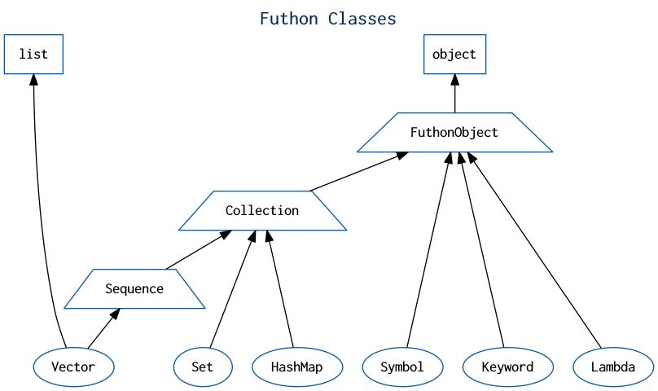
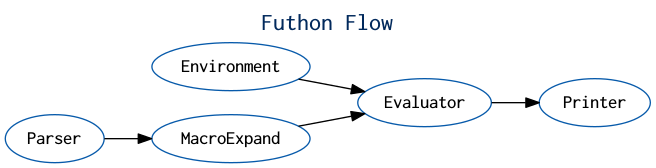

# Futhon Programming Language
[](https://travis-ci.org/rcmdnk/travis-test)
[](https://codeclimate.com/github/delihiros/futhon)

Futhon is a programming language designed for Natural Language Processing and Machine Learning.

## Try!

Python 3.5+ is required.

```
$ git clone https://github.com/delihiros/futhon.git
$ cd futhon
$ pip install -r requirements.txt -r test-requirements.txt
$ python src/repl.py
```

## Test

```
python setup.py test
```

## Example

```clojure
(def np (import numpy))
(def chainer (import chainer))

(def l1 (chainer.links.Linear 4 3))
(def l2 (chainer.links.Linear 3 2))

(def my-forward
  (fn [x] (l2 (l1 x))))

(def x (.astype (np.array [[1 2 3 4]]) np.float32))

(.data (my-forward x))
; [[-1.02830815  0.6110245 ]]
```

## Primitives



## Flow


